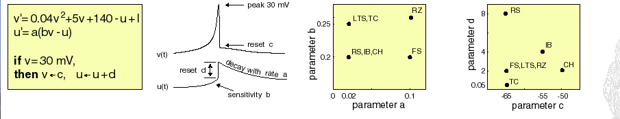

# Izhikevich-Neural-Model
&nbsp;

We investigated the consequences of using half precision floating (hFP) points on Spike Neural Network (SNN) simulations. This topic is relevant because hFP requires half of the memory space, lower bandwidth, lower clock frequency and lower power consumption; essential factors for real-time simulation of SNN on embedded electronics. 
The floating points conversion circuits (32 bits to 16 bits and vice-versa), may be implemented using few
logical blocks in field-programmable gate arrays (FPGA) with no relevant latency. We conclude that, for implementing floating point computed SNN in FPGAs, storing data on hFP format is suitable and effective, even though it requires conversion circuits.

&nbsp;
&nbsp;

Reference: https://www.izhikevich.org/publications/spikes.htm

&nbsp;
&nbsp;

###### This study was publish at 2018 International Joint Conference on Neural Networks (IJCNN):https://ieeexplore.ieee.org/abstract/document/8489438
